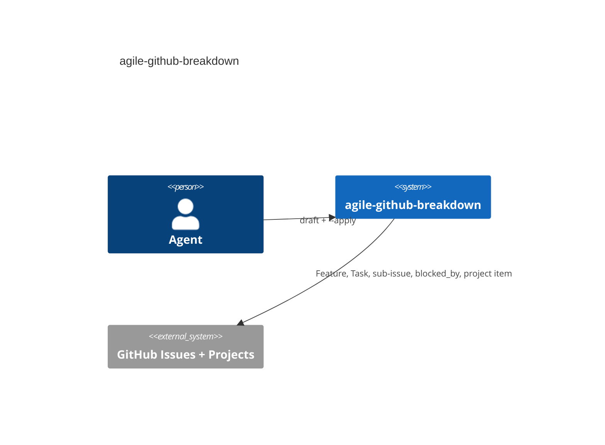
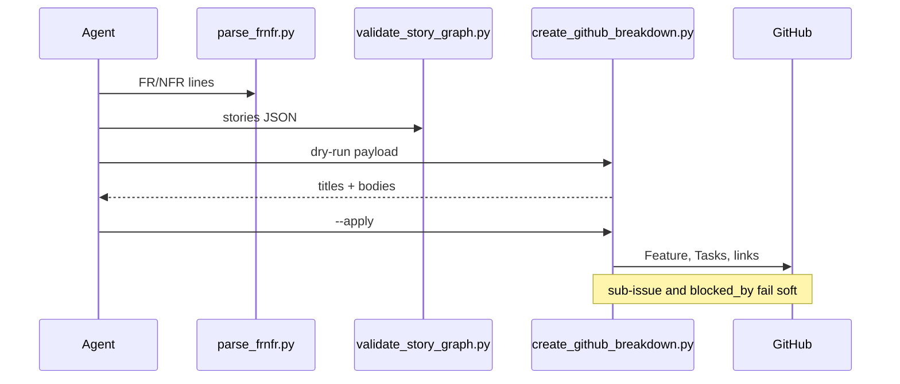

# agile-github-breakdown — AGENTS.md

## TL;DR

Judgment-heavy skill for turning requirements (braindump, transcript, or existing GitHub Feature)
into terse Tasks with a real dependency graph. Two small `python3` scripts handle the deterministic
checks (ID extraction, cycle/dangling-dependency detection, coverage/sub-numbering); a third owns
`gh` writes. Everything else — which Tasks exist, how a requirement reads as an AC — stays agent
judgment. Unlike `create-hld`'s scaffold script, parse/validate don't generate any files; they only
validate/extract.

## Non-Negotiables

- **Dry run is the default, not an option.** Every write path waits for an explicit go-ahead unless
  the user's own request already authorized live creation in the same turn. `create_github_breakdown.py`
  requires `--apply`.
- **Delete is never the answer for a superseded GitHub issue.** Recommend close/link instead, every
  time, even if asked directly whether to delete.
- **Never create an org issue type.** Vanilla types are Task / Bug / Feature. An Epic type is an
  org-admin side effect and still does not give Projects an Epic container.
- **FR/NFR IDs are load-bearing.** A Task's acceptance criteria must cite the ID they translate from.
  If a requirement can't be traced to the source, either it's genuinely new scope (say so) or the
  breakdown missed something (surface it, don't paper over it).
- **The Translation (AI context) table must appear on every Feature and Task body.** The write
  script appends it if missing; do not strip it on a later edit.
- **Technology suggestions never harden into requirements.** Even a team's clear technical
  preference gets the "for example... team's call" phrasing — the Task states the outcome the
  team must hit, not the mechanism, mirroring `create-hld`'s "requirement, not recipe" rule.
- **The local context-doc mirror (`.context/*-context.md` or similar) is a Conductor-workspace
  convenience, not a universal repo convention.** Never create one unprompted.

## System Context

Writes GitHub Issues + Project items. Agent authors content; `create_github_breakdown.py` owns `gh`.

## Architecture Decisions

### LADR-001 — Dry-run default; GitHub links fail soft

- **Date:** 2026-09-13 · **Status:** Accepted
- **Context:** Live issue create is irreversible shared state. Sub-issue / `blocked_by` APIs fail on some tokens.
- **Decision:** No GitHub write without `--apply`. Sub-issue and `blocked_by` print a manual fallback instead of aborting a partial graph.
- **Consequences:** "Created but not linked" is expected. Do not hard-fail those calls; that would leave Tasks without a Feature parent and no report.

## Key Behaviors

- Vanilla GitHub graph, matching `builder-catalogue#21`: Project (initiative) → Feature (epic) →
  Task (story) → untyped issue (subtask, out of scope here).
- Default project is `1`, overridable with `--project`. Same default `agile-github-task-from-diff`
  uses — don't diverge without reason.
- **Features have no parent** — never set one on a new Feature unless the user gives one. Tasks
  always become sub-issues of the Feature.
- **Stories are GitHub `Task`, never Feature and never untyped.** Untyped issues are the subtask
  layer owned by `agile-github-task-from-diff`.
- Sub-numbering (`S2.1`/`S2.2`) is used specifically for stub→consumer pairs. It is not a general
  substitute for a proper dependency graph.
- `scripts/validate_story_graph.py` exits non-zero on a cycle or a dangling `depends_on` — treat that
  as a hard stop on the draft, not a warning. Missing-coverage and sub-numbering-suggestion entries
  are warnings; every one must be either acted on or explicitly dismissed with a reason.
  **Exit 1 and exit 2 mean different things:** 1 is a graph that parsed but failed validation, 2 is
  input this script could not read at all.
- **`stories` is required; `requirement_ids` is optional. The asymmetry is deliberate — don't
  "tidy" it.** An omitted `stories` used to default to `[]` and report all-clear on a payload
  carrying no draft, so absence is now exit 2 while an explicit `[]` stays valid.
  `requirement_ids` must stay optional because its absence is what switches the `unknown_ac_ids`
  check off.
- Existing GitHub issue refs in `depends_on` (e.g. `#42`) must be passed via `--known-external` to
  `validate_story_graph.py`, or the script will flag them as dangling.
- **`parse_frnfr.py` does not parse Markdown, and must not be given a raw Feature body.**
  Its input is an explicit `<ID> | <text>` list that the agent extracts. Narrowing the contract
  deleted a class of silent mis-parses; do not re-add table discovery.
- **Exit codes: 0 parsed, 1 nothing matched, 2 malformed input.** Exit 1 is a real stop, not "this
  Feature has no requirements" — an empty requirement list is the one failure the coverage chain
  cannot detect. Never work around a non-zero exit by proceeding with an empty list.
- **The ID must be bare** (`FR-1`), not `**FR-1**` or `[FR-1](...)`.
- **Both scripts treat a bare string where a list belongs as malformed, deliberately.** Python
  iterates a string by character, so `set("FR-12")` equals `set("FR-21")` and every coverage diff
  comes back empty. Don't relax it to "accept a string for convenience".
- Sub-issue linking and `blocked_by` fail soft: the write script prints a manual-link fallback
  instead of erroring, matching `agile-github-task-from-diff`.

## Test References

`scripts/test_skill_scripts.py` — stdlib `unittest`, no dependencies. Run directly
(`python3 .agents/skills/agile-github-breakdown/scripts/test_skill_scripts.py`); `unittest discover`
fails because `.agents` is not an importable path segment. **Deliberately not wired into CI** —
skills are not production code. Add a case here for any defect found in parse/validate.

## Changelog

| Date | Change | Ref |
|:-----|:-------|:----|
| 2026-09-13 | Ported from `epic-breakdown` onto vanilla GitHub Projects (Feature/Task/Project; no Epic type). | |
| 2026-09-13 | Copilot review: translation-table marker, payload preflight, dry-run bodies, merge Tasks table, diagrams. | |
