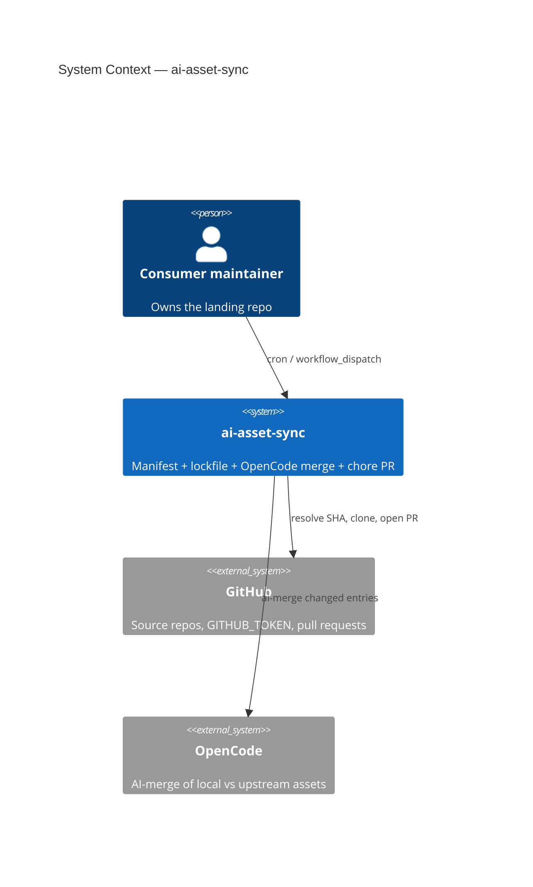
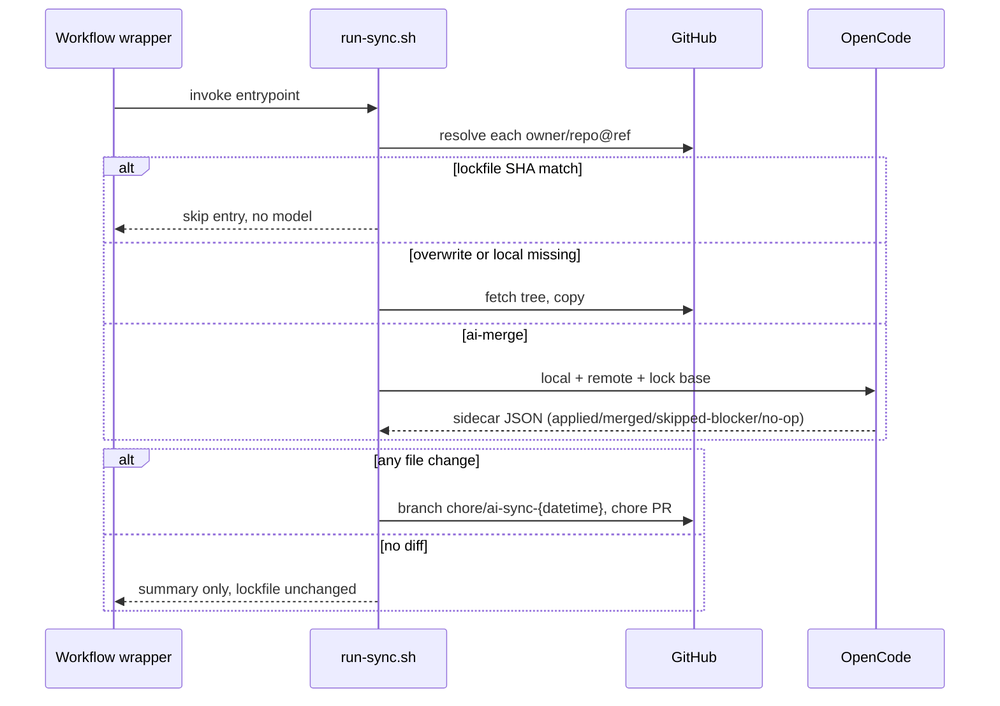

# ai-asset-sync — AGENTS.md

## TL;DR

Dependabot-style AI-asset sync: one CI entrypoint (`scripts/run-sync.sh`) reconciles manifest sources with local skills/rules via OpenCode, then opens a single chore PR — never a blind overwrite, never a lockfile-only PR.

## Non-Negotiables

- **Behaviour lives in `run-sync.sh`.** Workflow YAML and the composite action are thin wrappers. A sync-behaviour change that lands only in YAML is a bug.
- **Remote path == local path.** Do not add a destination/rename field. That is an explicit non-goal.
- **Blocker → leave the local tree untouched** and report in the PR body. Do not clobber a heavily diverged consumer copy.
- **No file diff → no PR.** Lockfile SHA is advanced only inside a real sync PR. Equivalent/no-op runs re-analyse next time (accepted model cost).
- **Secrets stay in the environment.** `OPENCODE_<PROVIDER>_API_KEY` and `GITHUB_TOKEN` are read by scripts / `gh` / opencode `{env:…}` placeholders. Never echo, never put in prompts, never commit.

## System Context

Consumer repos copy-install skills/rules from upstream and drift. This skill is the scheduled reconciler: manifest in the consumer, lockfile for SHA short-circuit, OpenCode agent as AI-DevEx expert, one PR per run.

## Architecture Decisions

### LADR-001: Two packagings, one implementation

- **Date**: 2026-09-13
- **Status**: Accepted
- **Context**: Same split as `smooth-ai-report-review`: reusable `workflow_call` vs skill-installed-locally. Duplicating logic in YAML drifts.
- **Decision**: All sync behaviour lives in `scripts/run-sync.sh`. The composite action and reusable workflow only install context, export env, and call the script. Side-checkout uses `github.job_workflow_sha` (not `workflow_sha`).
- **Consequences**: Consumer-local skill wins over the tooling checkout. Tests target the script, not YAML.

### LADR-002: Lockfile advances only inside a file-changing PR

- **Date**: 2026-09-13
- **Status**: Accepted
- **Context**: "AI says equivalent, no PR" still needs a commit to advance the lockfile. A lockfile-only PR is noise; skipping the advance repeats the model call.
- **Decision**: Do not open a lockfile-only PR. Unchanged / no-op / skipped-blocker entries do not advance. Next scheduled run re-resolves and may call the model again.
- **Consequences**: Cost on equivalent upstream bumps until a *different* entry produces a real PR (which then writes the whole advanced lockfile). Documented in the wiki.

### LADR-003: `sync` OpenCode agent is edit-capable, not bash-capable

- **Date**: 2026-09-13
- **Status**: Accepted
- **Context**: Review-report's `review` agent cannot write files; analyse can edit but is scoped to review findings. Asset sync must write merged trees.
- **Decision**: Dedicated `sync` agent in `assets/opencode.json`: `edit` allow, `bash`/`skill`/`task` deny. Git/PR/clone stay in `run-sync.sh`.
- **Consequences**: Prompt-injected upstream content cannot `rm` or push, and with `external_directory: deny` plus the in-repo scratch dir it cannot edit anything outside the repo root either. Merge quality depends on the model seeing both trees via read/grep.

## Key Behaviors

- Manifest schema is a **YAML subset** parsed by `scripts/lib/parse_manifest.py` (stdlib, not PyYAML). Keep entries as `- source:` / optional `strategy:` — do not add nested maps the parser cannot see.
- `source` shape is `owner/repo@ref:path`. First `:` after `@` starts the path, so refs must not contain `:`. Charsets are strict (owner/repo `[A-Za-z0-9._-]`, ref `[A-Za-z0-9._/-]`, no leading `-`, no `..` segments) because these values flow into `gh api` / `gh repo clone` — loosening them reopens an injection surface.
- Staging is containment-scoped: only paths whose sidecar action is `applied`/`merged` (plus the lockfile) are `git add`ed. Edits the agent makes outside those paths are left unstaged and warned about — a prompt-injected upstream cannot smuggle changes to other entries into the commit.
- 3-way limitation: the lockfile base SHA is passed to the model as provenance text only; the base tree is NOT checked out. Merge quality relies on local + remote trees.
- Sandbox: the scratch dir (upstream clones, prompts, reports) lives INSIDE the repo root (`.ai-sync-tmp.*`, excluded via `info/exclude`, removed on exit) so `external_directory` is DENIED in `assets/opencode.json` — the agent cannot touch paths outside the repo.
- Pre-flight clean-tree guard: any uncommitted change under an entry path aborts the run before mutation, so pre-existing local edits can never be bundled into a sync PR.
- Entry paths are resolved to their PHYSICAL repo-relative form (symlink-aware — `.agents/rules` → `.github/instructions`) before all git status/staging; paths resolving outside the repo root are fatal.
- Manifest validation rejects overlapping entry paths (containment), `.`/`.git`/empty/`.` segments, and anything under `.github/workflows` (executable CI).
- `overwrite`/absent-local applies via replace (`rm -rf` then copy) so file↔directory type changes reconcile.
- Non-GEMINI providers REQUIRE an explicit model (`OPENCODE_AI_SYNC_MODEL_PRIMARY` or `--model`); only GEMINI has built-in model defaults. A nonzero `opencode run` exit is treated as `skipped-blocker` (snapshot restored) even if output parses.
- Lockfile is written into the worktree ONLY on the real-PR path — dry-run/no-pr runs never leave an advanced lockfile behind.
- Strategy `overwrite` never calls the model. Strategy `ai-merge` (default) calls it only when the local path already exists and the lockfile SHA differs.
- Fresh clone of a missing local path is `applied` without a model call.
- Branch is always new: `chore/ai-sync-{UTC YYYYMMDD-HHMM}-{GITHUB_RUN_ID}`. Do not force-push a stable branch.
- PR title defaults to `chore[NO-TICKET]: sync AI assets` (repo `<type>[{ticket}]:` convention; override via `--pr-title` / `AI_ASSET_SYNC_PR_TITLE`). Body starts from `.github/pull_request_template.md` plus provenance + Conflicts/Gaps/Issues/Blockers.
- `GITHUB_TOKEN` PRs do not trigger downstream `pull_request` workflows — expected, documented, not a bug.
- Private sources work only where that token can read (same repo/org). Cross-org private is out of scope.

## Test References

- `scripts/lib/test_parse_manifest.py` — stdlib unittest; run directly (`.agents` is not an importable package). Not wired into CI.

## Changelog

| Date | Change | Ref |
|:-----|:-------|:----|
| 2026-09-13 | Initial skill: manifest/lockfile, AI-merge, composite action, reusable workflow. | |
| 2026-09-13 | Review hardening: strict source charsets + negative tests, containment-scoped staging, fd-3 work loop, `synced_at` stamped, tools_ref precedence (input > Variable), 3-way limitation documented. | |
| 2026-09-13 | Copilot-review hardening: in-repo sandbox + `external_directory: deny`, dangerous-destination + overlap manifest rejection, clean-tree guard, symlink-physical git paths, lockfile write moved to PR path, `chore[NO-TICKET]` title (+ `--pr-title`), run-id branch suffix, installer PATH propagation, non-Gemini model fail-fast, nonzero-exit → blocker, type-change-safe overwrite. | #66 |
