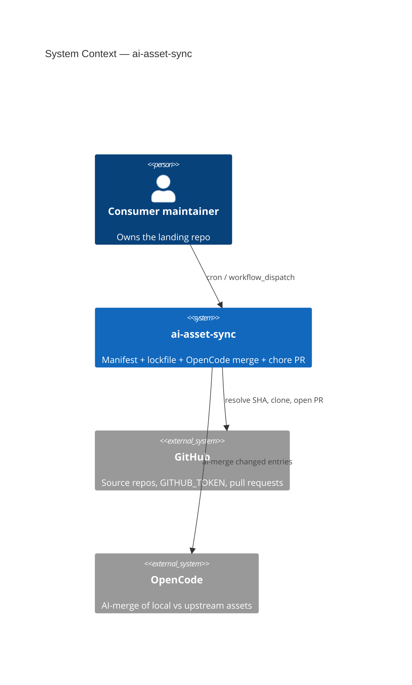
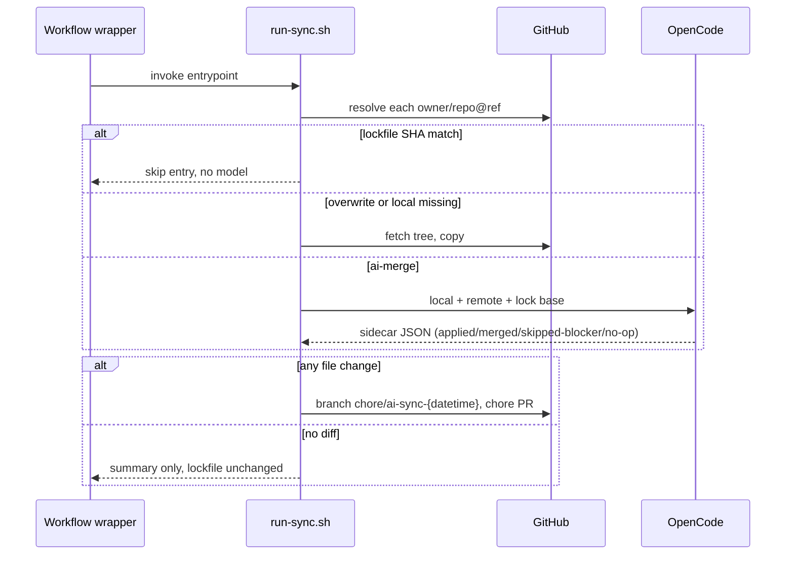

# ai-asset-sync — AGENTS.md

## TL;DR

Dependabot-style AI-asset sync: one CI entrypoint (`scripts/run-sync.sh`) reconciles manifest sources with local skills/rules via OpenCode, then opens a single chore PR — never a blind overwrite, never a lockfile-only PR.

## Non-Negotiables

- **Behaviour lives in `run-sync.sh`.** Workflow YAML and the composite action are thin wrappers. A sync-behaviour change that lands only in YAML is a bug.
- **Remote path == local path.** Do not add a destination/rename field. That is an explicit non-goal.
- **Blocker → leave the local tree untouched** and report in the PR body. Do not clobber a heavily diverged consumer copy.
- **No file diff → no PR.** Lockfile SHA is advanced only inside a real sync PR. Equivalent/no-op runs re-analyse next time (accepted model cost).
- **Secrets stay in the environment.** `OPENCODE_<PROVIDER>_API_KEY` and `GITHUB_TOKEN` are read by scripts / `gh` / opencode `{env:…}` placeholders. Never echo, never put in prompts, never commit.
- **The model never reaches a credential (LADR-004).** Launch opencode only through `run_model` (env allowlist). Keep `.git/**` and `.env*` denied for `read` and `edit`. Never drop `persist-credentials: false`, or the set-aside/restore of a persisted checkout credential around the merge loop, and keep `core.hooksPath=/dev/null` on the bot's commit/push. Removing any one of these re-opens a path from injected upstream content to `GITHUB_TOKEN`.

## System Context

Consumer repos copy-install skills/rules from upstream and drift. This skill is the scheduled reconciler: manifest in the consumer, lockfile for SHA short-circuit, OpenCode agent as AI-DevEx expert, one PR per run.

```mermaid
C4Context
    title System Context — ai-asset-sync

    Person(maintainer, "Consumer maintainer", "Owns the landing repo")
    System(sync, "ai-asset-sync", "Manifest + lockfile + OpenCode merge + chore PR")
    System_Ext(gh, "GitHub", "Source repos, GITHUB_TOKEN, pull requests")
    System_Ext(oc, "OpenCode", "AI-merge of local vs upstream assets")

    Rel(maintainer, sync, "cron / workflow_dispatch")
    Rel(sync, gh, "resolve SHA, clone, open PR")
    Rel(sync, oc, "ai-merge changed entries")
```

```mermaid
sequenceDiagram
    participant WF as Workflow wrapper
    participant Sync as run-sync.sh
    participant GH as GitHub
    participant OC as OpenCode

    WF->>Sync: invoke entrypoint
    Sync->>GH: resolve each owner/repo@ref
    alt lockfile SHA match
        Sync-->>WF: skip entry, no model
    else overwrite or local missing
        Sync->>GH: fetch tree, copy
    else ai-merge
        Sync->>OC: local + remote + lock base
        OC-->>Sync: sidecar JSON (applied/merged/skipped-blocker/no-op)
    end
    alt any file change
        Sync->>GH: branch chore/ai-sync-{datetime}, chore PR
    else no diff
        Sync-->>WF: summary only, lockfile unchanged
    end
```

## Architecture Decisions

### LADR-001: Two packagings, one implementation

- **Date**: 2026-09-13
- **Status**: Accepted
- **Context**: Same split as `smooth-ai-report-review`: reusable `workflow_call` vs skill-installed-locally. Duplicating logic in YAML drifts.
- **Decision**: All sync behaviour lives in `scripts/run-sync.sh`. The composite action and reusable workflow only install context, export env, and call the script. Side-checkout uses `github.job_workflow_sha` (not `workflow_sha`).
- **Consequences**: Consumer-local skill wins over the tooling checkout. Tests target the script, not YAML.

### LADR-002: Lockfile advances only inside a file-changing PR

- **Date**: 2026-09-13
- **Status**: Accepted
- **Context**: "AI says equivalent, no PR" still needs a commit to advance the lockfile. A lockfile-only PR is noise; skipping the advance repeats the model call.
- **Decision**: Do not open a lockfile-only PR. Unchanged / no-op / skipped-blocker entries do not advance. Next scheduled run re-resolves and may call the model again.
- **Consequences**: Cost on equivalent upstream bumps until a *different* entry produces a real PR (which then writes the whole advanced lockfile). Documented in the wiki.

### LADR-003: `sync` OpenCode agent is edit-capable, not bash-capable

- **Date**: 2026-09-13
- **Status**: Accepted
- **Context**: Review-report's `review` agent cannot write files; analyse can edit but is scoped to review findings. Asset sync must write merged trees.
- **Decision**: Dedicated `sync` agent in `assets/opencode.json`: `edit` allow, `bash`/`skill`/`task` deny. Git/PR/clone stay in `run-sync.sh`.
- **Consequences**: Prompt-injected upstream content cannot `rm` or push, and with `external_directory: deny` plus the in-repo scratch dir it cannot edit anything outside the repo root either. Merge quality depends on the model seeing both trees via read/grep. **Gap closed by LADR-004:** "inside the repo root" included `.git/`, so the agent could read a persisted checkout token and write a git hook that the script's own push would run.

### LADR-004: Credential isolation for the model process

- **Date**: 2026-09-27
- **Status**: Accepted
- **Context**: LADR-003 blocked shell and outside-repo paths, but the model could still reach credentials three ways. (1) `actions/checkout` persists the job token as an `extraheader` in `.git/config`, inside the readable repo root. (2) `edit` over `.git/hooks/` (or a tracked hook dir such as `.husky/`) plants code that `git commit`/`git push` run with `GH_TOKEN` in their environment. (3) The opencode child inherited the whole environment: `GH_TOKEN`, every provider key and, on a developer shell, unrelated tokens. The agent-level `read: "allow"` also replaced opencode's default `.env` deny.
- **Decision**: (1) Checkouts use `persist-credentials: false`; the script pushes through a one-shot `gh auth git-credential` helper. If `.git/config` still holds a checkout `extraheader` (v4/v5 default), the script **sets it aside** before the first ai-merge: it backs the file up under `RUNNER_TEMP`/`TMPDIR` (outside the model's reach), removes the header, and restores the file byte-for-byte after the merge loop and in the exit trap. A credentialed remote URL still **fails closed**, since rewriting a user's remote is not ours to do. Only the repo's own config file is inspected, since an included credentials file outside the repo (checkout v6) is beyond the model's reach. (2) `read`/`edit` deny `.git/**`; `read` restates the `.env` denies; the bot's commit and push run with `core.hooksPath=/dev/null`. (3) `run_model` launches opencode from a subshell that unsets everything outside an allowlist: system/locale/proxy/CA variables, the selected key, and `OPENCODE_*` names that do not look like secrets.
- **Consequences**: Composite-action consumers need no change; later steps in their job still find the credential after restore. **Rejected alternative:** fail closed on a persisted `extraheader`. It broke every default-checkout consumer to protect against a file the script can safely move aside itself. A custom `OPENCODE_AI_SYNC_CONFIG` may reference only allowlisted variables, the selected key, or non-secret `OPENCODE_*` names. Consumer repo hooks do not run on sync commits. **Rejected alternative:** a deny-list (`env -u …`): it passed through every token nobody listed, as a local test showed. **Rejected alternative:** `env -i NAME=value`: it puts the key in the process list.

## Key Behaviors

- Manifest schema is a **YAML subset** parsed by `scripts/lib/parse_manifest.py` (stdlib, not PyYAML). Keep entries as `- source:` / optional `strategy:` — do not add nested maps the parser cannot see.
- `source` shape is `owner/repo@ref:path`. First `:` after `@` starts the path, so refs must not contain `:`. Charsets are strict (owner/repo `[A-Za-z0-9._-]`, ref `[A-Za-z0-9._/-]`, no leading `-`, no `..` segments) because these values flow into `gh api` / `gh repo clone` — loosening them reopens an injection surface.
- Staging is containment-scoped: only paths whose sidecar action is `applied`/`merged` (plus the lockfile) are `git add`ed. Edits the agent makes outside those paths are left unstaged and warned about — a prompt-injected upstream cannot smuggle changes to other entries into the commit.
- 3-way limitation: the lockfile base SHA is passed to the model as provenance text only; the base tree is NOT checked out. Merge quality relies on local + remote trees.
- Credential set-aside runs only when some entry has `strategy: ai-merge`, after the clean-tree guard and before any network or model call. The restore is a whole-file copy-back, safe because nothing writes `.git/config` between set-aside and the end of the merge loop. A new `git config` write inside the loop would be lost on restore, so move it after the loop.
- Sandbox: the scratch dir (upstream clones, prompts, reports) lives INSIDE the repo root (`.ai-sync-tmp.*`, excluded via `info/exclude`, removed on exit) so `external_directory` is DENIED in `assets/opencode.json` — the agent cannot touch paths outside the repo.
- Pre-flight clean-tree guard: any uncommitted change under an entry path aborts the run before mutation, so pre-existing local edits can never be bundled into a sync PR.
- Entry paths are resolved to their PHYSICAL repo-relative form (symlink-aware — `.agents/rules` → `.github/instructions`) before all git status/staging; paths resolving outside the repo root are fatal.
- Manifest validation rejects overlapping entry paths (containment), `.`/`.git`/empty/`.` segments, and anything under `.github/workflows` (executable CI).
- `overwrite`/absent-local applies via replace (`rm -rf` then copy) so file↔directory type changes reconcile.
- Non-GEMINI providers REQUIRE an explicit model (`OPENCODE_AI_SYNC_MODEL_PRIMARY` or `--model`); only GEMINI has built-in model defaults. A nonzero `opencode run` exit is treated as `skipped-blocker` (snapshot restored) even if output parses.
- Lockfile is written into the worktree ONLY on the real-PR path — dry-run/no-pr runs never leave an advanced lockfile behind.
- Strategy `overwrite` never calls the model. Strategy `ai-merge` (default) calls it only when the local path already exists and the lockfile SHA differs.
- Fresh clone of a missing local path is `applied` without a model call.
- Branch is always new: `chore/ai-sync-{UTC YYYYMMDD-HHMM}-{GITHUB_RUN_ID}`. Do not force-push a stable branch.
- PR title defaults to `chore[NO-TICKET]: sync AI assets` (repo `<type>[{ticket}]:` convention; override via `--pr-title` / `AI_ASSET_SYNC_PR_TITLE`). Body starts from `.github/pull_request_template.md` plus provenance + Conflicts/Gaps/Issues/Blockers.
- `GITHUB_TOKEN` PRs do not trigger downstream `pull_request` workflows — expected, documented, not a bug.
- Private sources work only where that token can read (same repo/org). Cross-org private is out of scope.

## Test References

- `scripts/lib/test_parse_manifest.py` — stdlib unittest; run directly (`.agents` is not an importable package). Not wired into CI.

## Changelog

| Date | Change | Ref |
|:-----|:-------|:----|
| 2026-09-13 | Initial skill: manifest/lockfile, AI-merge, composite action, reusable workflow. | |
| 2026-09-13 | Review hardening: strict source charsets + negative tests, containment-scoped staging, fd-3 work loop, `synced_at` stamped, tools_ref precedence (input > Variable), 3-way limitation documented. | |
| 2026-09-13 | Copilot-review hardening: in-repo sandbox + `external_directory: deny`, dangerous-destination + overlap manifest rejection, clean-tree guard, symlink-physical git paths, lockfile write moved to PR path, `chore[NO-TICKET]` title (+ `--pr-title`), run-id branch suffix, installer PATH propagation, non-Gemini model fail-fast, nonzero-exit → blocker, type-change-safe overwrite. | #66 |
| 2026-09-27 | LADR-004 credential isolation: env allowlist for the opencode child, `.git/**` + `.env*` denied for read/edit, `persist-credentials: false` + set-aside/restore of a persisted checkout credential (credentialed remote URL fails closed), hook-free commit/push via one-shot `gh` credential helper, provider keys moved to step scope. | |
