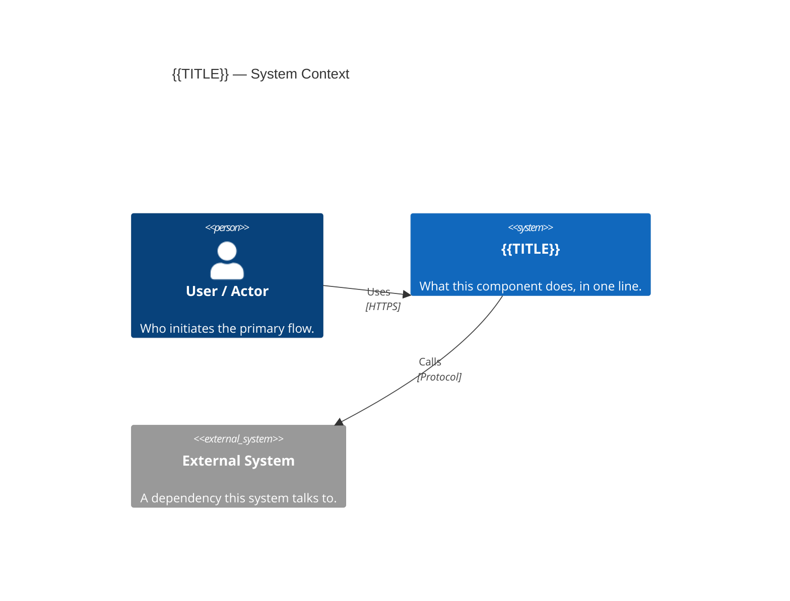

# Diagrams — {{TITLE}}

The **C1 System Context** below is the mandatory floor for every HLD. Add further diagrams
only where they earn their place (see the skill's `references/diagram-selection.md`); each
addition gets its own `## ` section here (or its own file in this folder) and a one-line
rationale.

## System Context (C1)

<2–4 sentences: what this system is and its immediate external dependencies.>



---

### Authoring guide — optional additional diagrams (delete this whole section before finalizing)

The snippets below are a copy-paste catalog for the human or agent composing the HLD. They
are shown as plain `text` fences so they do not render (they contain placeholders like `...`).
When you keep one, copy it into its own `## ` section and change the fence to `mermaid`; delete
the rest **and** delete this guide section.

**Container View (C2)** — when the system splits into >1 deployable/runtime unit:

```text
C4Container
    title {{TITLE}} — Containers
    ...
```

**Flow — <named flow>** — process/decision flows; a path through the system:

```text
flowchart TD
    A[Start] --> B{Decision}
    B -->|yes| C[Action]
    B -->|no| D[Alternative]
```

**Sequence — <named flow>** — interactions with 3+ steps OR side effects (email, queue, external call):

```text
sequenceDiagram
    participant A as Caller
    participant B as Service
    A->>B: request
    B-->>A: response
```

**Data Model** — 3+ related entities with non-obvious relationships:

```text
erDiagram
    ENTITY_A ||--o{ ENTITY_B : has
```

**Domain Types** — key classes/types and their relationships:

```text
classDiagram
    class TypeA
    TypeA --> TypeB
```
